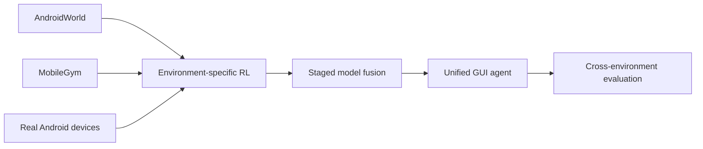

# Hi, I'm Ziwei Chen (陈子威) 👋

### LLM Systems · Reinforcement Learning · GUI Agents · Multimodal AI

I build AI systems that move beyond demos: agents that interact with real interfaces,  
training pipelines that survive long-running experiments, and evaluations that explain *why* a model works or fails.

## About me

- 🎓 M.Sc. in **Data Science and AI** from Chalmers University of Technology (top 10%).
- 🤖 Focused on **reinforcement learning for GUI agents**, LLM agents, RAG, and efficient model deployment.
- 🧠 Experienced with model serving, agent architecture, evaluation, fine-tuning, pruning, and quantization.
- 🌍 Comfortable working in international research and engineering teams in English and Chinese.
- 🎤 Gave a live AI knowledge-sharing talk to an audience of 700+ people.

## Featured project

### REALMIX — Reinforcement Learning for GUI Agents

> **Active research project** · Three-environment training and evaluation for agents that operate graphical interfaces

REALMIX investigates how a vision-language agent can learn transferable interaction skills across **AndroidWorld**, **MobileGym**, and **physical Android devices**, then combine those skills into a single fused policy.

What I am building:

- **Training:** online GRPO-style policy optimization for vision-language GUI agents.
- **Fusion:** staged training across simulated and real environments to study transfer and interference.
- **Evaluation:** a matched comparison of the base, single-environment, and fused models across all three environments.
- **Reliability:** frozen task splits, reproducible manifests, trajectory-level audits, automated judges, and failure recovery.
- **Infrastructure:** VERL, vLLM, Hugging Face Transformers, Slurm, ADB, and multi-device experiment orchestration on Isambard HPC.

The end-to-end training and evaluation pipeline is currently active. Final cross-environment results will be published only after the remaining real-device evaluations and audits are complete.

## Selected experience

| Organization | Work |
| --- | --- |
| **Huawei Sweden Research Institute** | Deployed Llama 3 with vLLM; built an LLM agent that turns design documents into UML diagrams; researched MoE-to-dense compression, pruning, quantization, and efficient fine-tuning. |
| **AstraZeneca R&D** | Built a medical RAG assistant with LangChain and Chroma; designed retrieval and citation evaluation, reranking, self-improving answer generation, and embedding-space analysis. |
| **Volvo Group** | Developed an automotive LLM-agent framework and an end-to-end REST API testing agent for embedded systems, covering test generation, deployment, debugging, edge cases, and result analysis. |
| **Nanjing Falcon Eye Electronic Technology** | Built a millimeter-wave radar gait-recognition pipeline using micro-Doppler features, CVD, beamforming, and two-stream CNNs. |

## Technical toolbox

  
  
  
  
  
  
  
  

**AI & research:** reinforcement learning, GUI agents, LLM agents, RAG, multimodal learning, model evaluation, model compression, computer vision  
**Engineering:** Python, Java, MATLAB, SQL, REST APIs, distributed training, Slurm, Docker, Linux

## Education

- **Chalmers University of Technology** — M.Sc. Data Science and AI, 2024  
  GPA: 4.25/5 · Top 10%
- **University of Twente** — B.Sc. Computer Science, 2021  
  GPA: 7.1/10 · Top 25%

## Current interests

I am especially interested in:

1. Making GUI agents reliable on real devices, not just benchmark environments.
2. Understanding transfer, interference, and reward design in multi-environment RL.
3. Building evaluation systems with traceable evidence instead of opaque aggregate scores.
4. Compressing and serving capable models under practical compute constraints.

